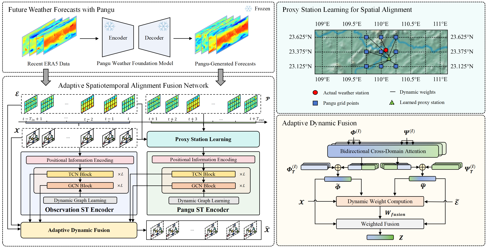

# ASTAFN

This is a PyTorch implementation of the paper: **ASTAFN: Bridging the Gap Between Weather Foundation Models and Accurate Station-Level Forecasting**, accepted by SIGKDD 2026 ADS Track V1.

# 📌 Overview

Weather Foundation Models (WFMs) achieve strong performance and high efficiency in global weather forecasting, but their coarse resolution and inherent biases limit their effectiveness for station-level prediction. To address this, we propose **ASTAFN (Adaptive Spatiotemporal Alignment Fusion Network)**, a unified framework that bridges WFMs and station observations for accurate station-level forecasting. ASTAFN integrates (1) recent station observations for capturing local temporal dynamics and (2) WFM forecasts for providing large-scale atmospheric context. Its core innovation is a **proxy station learning mechanism**, which aligns spatial representations between WFMs and station data while correcting systematic biases. **A dynamic fusion module** further adaptively combines multi-source information across forecasting steps, improving robustness and accuracy.



# 🚀 Quick Start

This section provides a step-by-step guide to using ASTAFN, including environment setup, dataset preparation, pretrained model download, and inference.

## 🧪 1. Environment Setup

We recommend using **Python 3.9**.

Create a new environment and install dependencies:

```bash
pip install -r requirements.txt
```

## 📂 2. Dataset Preparation

You can obtain the three well-preprocessed datasets—`California`, `GUANGDONG`, and `YUNNAN`—from the following [Google Drive](https://drive.google.com/drive/folders/1bbiM3ySPQqcKh8HDMCzgHW272WH_1FIq). After downloading, place the datasets in the `./dataset` folder. Final structure:

~~~
dataset/
 ├── California/
 ├── Guangdong/
 ├── Yunnan/
~~~

The datasets used in this work are **exactly consistent with the final version reported in the paper**.  All spatial resolutions, station counts, and grid alignments strictly correspond to the descriptions in the paper. The detailed dataset configuration is summarized as follows:

| Dataset    | Source               | Spatial Representation |
| ---------- | -------------------- | ---------------------- |
| Guangdong  | Station Observations | 30 stations            |
|            | ERA5 Grid            | 25 × 36 grid           |
|            | Pangu Grid Forecast  | 25 × 36 grid           |
| Yunnan     | Station Observations | 19 stations            |
|            | ERA5 Grid            | 37 × 40 grid           |
|            | Pangu Grid Forecast  | 37 × 40 grid           |
| California | Station Observations | 101 stations           |
|            | ERA5 Grid            | 41 × 40 grid           |
|            | Pangu Grid Forecast  | 41 × 40 grid           |

## 💾 3. Pretrained Model Preparation

You can download the pretrained model checkpoint (.pth) from the following [Google Drive](https://drive.google.com/drive/folders/1sEJswjfqlIUZy7a9pPTmkQDSApi3cFOU). After downloading, place the checkpoint files into the `./save` directory. The final directory structure should be as follows:

~~~
save/
 ├── California/
 ├── Guangdong/
 ├── Yunnan/
~~~

The model takes the past **8 time steps** (1 day) as input and predicts **the next 8 steps** (24 hours) at 3-hour intervals.

## 🚀 4. Inference & Train

### 📍 Example: California

Run inference directly without training:

```
bash experiments/California/inference_msl.sh
bash experiments/California/inference_tmp.sh
bash experiments/California/inference_u.sh
bash experiments/California/inference_v.sh
```

Train the model directly:

~~~
bash experiments/California/train_msl.sh
bash experiments/California/train_tmp.sh
bash experiments/California/train_u.sh
bash experiments/California/train_v.sh
~~~

The corresponding station-level forecasting results will be saved under the directory `./save/California/ASTAFN/`.

For inference in the Guangdong or Yunnan regions, simply replace `California` with `GuangDong` or `YunNan`.

P.S. The results in the paper are averaged over multiple runs. We fix the random seed for evaluation, and small deviations from the reported numbers are expected due to stochasticity and do not affect the conclusions. In addition, due to the highly volatile wind speed characteristics in Yunnan, we provide a lightweight region-adapted variant of **ASTAFN**, referred to as **ASTAFN_adap**, with minor implementation-level adjustments while keeping the overall framework unchanged.

# 📖 Citation

If you find this work useful, please cite:

~~~
@inproceedings{10.1145/3770854.3783935,
author = {Xu, Bihe and Yan, Zhicheng and Li, Qingyong and Guo, Zhiqing and Zheng, Dong and Yao, Wen and Wang, Bo and Wang, Zhao and Geng, Yangliao},
title = {ASTAFN: Bridging the Gap Between Weather Foundation Models and Accurate Station-Level Forecasting},
year = {2026},
isbn = {9798400722585},
publisher = {Association for Computing Machinery},
address = {New York, NY, USA},
url = {https://doi.org/10.1145/3770854.3783935},
doi = {10.1145/3770854.3783935},
booktitle = {Proceedings of the 32nd ACM SIGKDD Conference on Knowledge Discovery and Data Mining V.1},
pages = {2494–2505},
numpages = {12},
keywords = {ai for weather, weather foundation model, station-level weather forecasting, spatiotemporal data mining},
location = {Republic of Korea},
series = {KDD '26}
}
~~~


